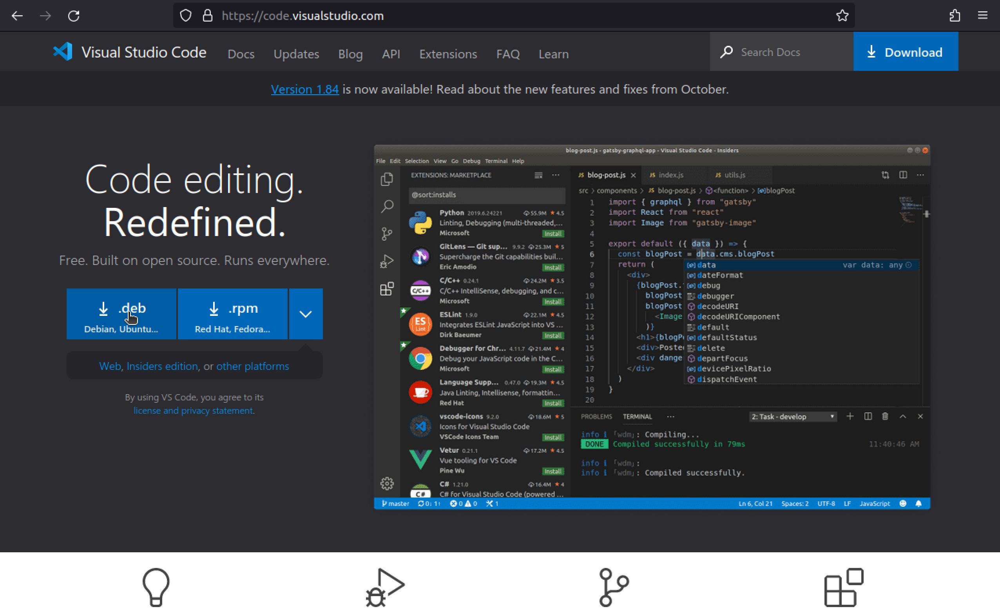
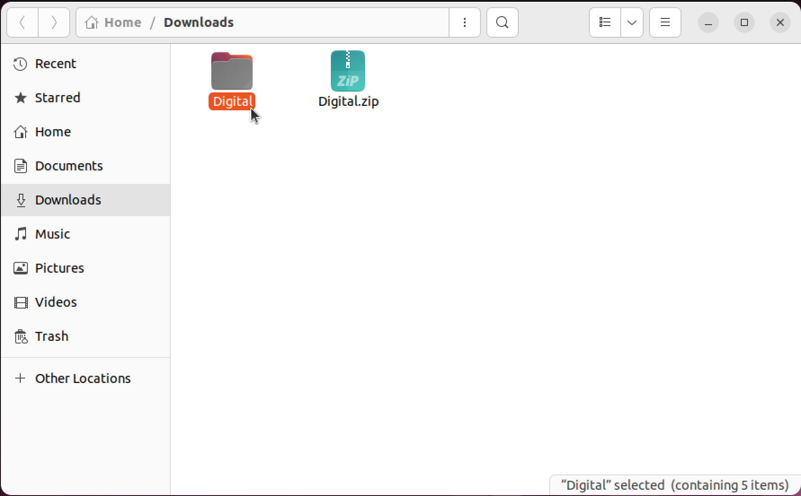
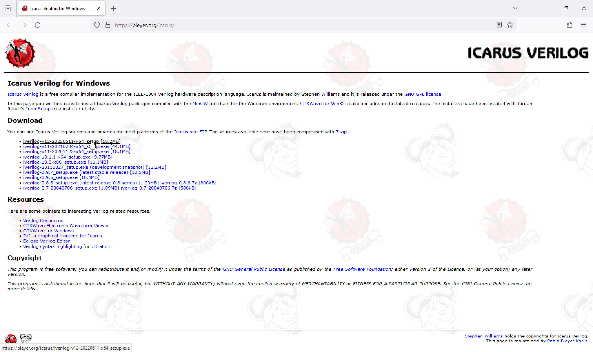
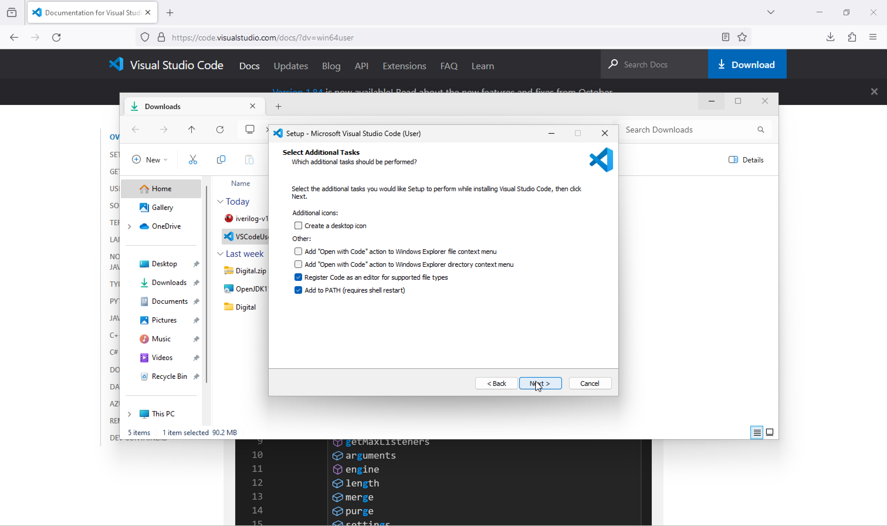
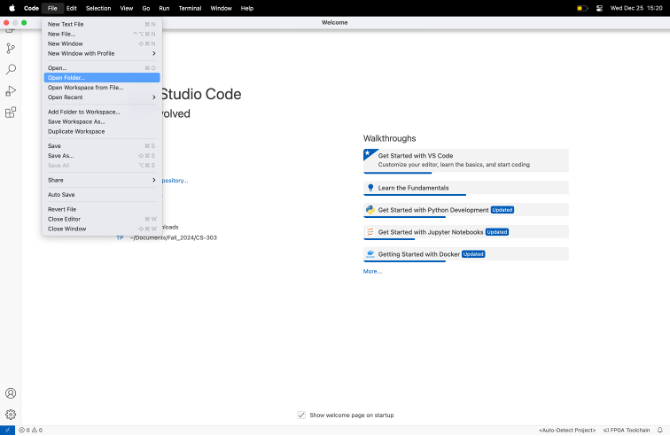
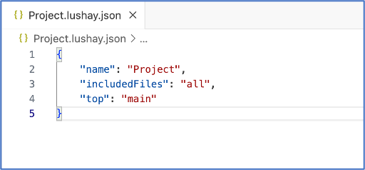

This document describes the setup of Digital Logic Simulator, VS Code, and Icarus Verilog for Windows, Mac, Ubuntu Linux.

**Prerequisites:** 
* A working internet connection
* One of the up to date OSs listed below installed on the machine
	* Linux (Tested on Ubuntu 22.04)
	* macOS (Tested on macOS 15)
	* Windows 11 (Windows 10 should also work)

> [!CAUTION]
> Earlier versions of macOS have permission issues with Java applications like Digital. Thus, they won't run, or even if they run, **you won't be able to see your files and folders**. We have come across similar issues in the previous years for macOS users. Hence, you must **update your macOS** to the latest version for Digital to work.

**Table Of Contents**

- [Linux (Ubuntu 22.04) Setup Guide](#linux-ubuntu-2204-setup-guide)
	- [Icarus Verilog Setup Linux](#icarus-verilog-setup-linux)
	- [Visual Studio Code Setup Linux](#visual-studio-code-setup-linux)
	- [Java Setup Linux](#java-setup-linux)
	- [Digital Logic Simulator Setup Linux](#digital-logic-simulator-setup-linux)
- [MacOS Setup Guide](#macos-setup-guide)
	- [Homebrew Setup](#homebrew-setup)
	- [Icarus Verilog Setup macOS](#icarus-verilog-setup-macos)
	- [Visual Studio Code Setup macOS](#visual-studio-code-setup-macos)
	- [Java Setup macOS](#java-setup-macos)
	- [Digital Logic Simulator Setup macOS](#digital-logic-simulator-setup-macos)
- [Windows Setup Guide](#windows-setup-guide)
	- [Icarus Verilog Setup Windows](#icarus-verilog-setup-windows)
	- [Visual Studio Code Setup Windows](#visual-studio-code-setup-windows)
	- [Java Setup Windows](#java-setup-windows)
	- [Digital Logic Simulator Setup Windows](#digital-logic-simulator-setup-windows)
- [TerosHDL Setup (For All OS)](#teroshdl-setup-for-all-os)
- [Surfer Setup (For All OS)](#surfer-setup-for-all-os)
- [FPGA Setup (For All OS)](#fpga-setup-for-all-os)


## Linux (Ubuntu 22.04) Setup Guide

### Icarus Verilog Setup Linux
For Ubuntu Linux use the following command on your terminal to download and setup Icarus Verilog.

```shell
sudo apt-get install iverilog
```


### Visual Studio Code Setup Linux

Go to the following link. 

https://code.visualstudio.com/

For Ubuntu Linux, click on  "**⬇ .deb**" option. 

Go to your downloads open a terminal window there. Right click on the folder and select "**Open In Terminal**". 

Use the following terminal command to install the package.

```shell
sudo dpkg -i {YOUR_INSTALLER_FILENAME_HERE}.deb
```

### Java Setup Linux

For Linux (Ubuntu 22.04) just run the following command in Terminal.

```sh
sudo apt-get install default-jre
```


### Digital Logic Simulator Setup Linux

Go to the following link. It will download **`Digital.zip`** file to your computer.

 https://github.com/hneemann/Digital/releases/latest/download/Digital.zip

* Right-click the file in File Manager and choose "**Extract here...**". 
* Open the "**`Digital`**" folder. 
* Right click on "**`Digital.sh`**" and click "**Run as a Program**".   
* You now have Digital Logic Simulator. You may continue with your assignments. 


## MacOS Setup Guide

### Homebrew Setup

Make sure that your macOS is updated to the latest version.


Download and install the updates, restart your computer if asked.


Open your terminal.


Paste the following shell command into your terminal

```shell
sudo xcode-select --install
```


Click "Install".


Click "Agree".


Wait patiently. This might take a while depending on your internet.


Follow installation instructions from https://brew.sh/.


Paste the shell command from the website.
> [!CAUTION]
> Always check the scripts that you are running. For this one we can look into the script and verify that it is safe.


Enter your password when asked.


Press Enter when asked, this process may take a while (~30 minutes depending on internet speed).


> [!NOTE] This step might take a long time!
> This download might take a full day, if your computer is out-of-date. We have observed that the Apple CDN is very slow on our university network. Please consider this and complete this step as soon as possible.


After the installation finishes, copy the two commands Homebrew prints out and paste it inside the Terminal window. It will be corresponding to your machine so copy it from the Terminal output. 


Verify that homebrew is installed successfully by running the following command, output should be similar to the picture.

```shell
brew
```


### Icarus Verilog Setup macOS


Install Icarus Verilog using the following command.

```shell
brew install icarus-verilog
```


After installation verify that Icarus Verilog has been installed by running the following command.

```shell
iverilog
```

It should output something like the following.

### Visual Studio Code Setup macOS

Go to the following link. 

https://code.visualstudio.com/

For macOS, click on  "**⬇  Mac**" option. 

Click allow if asked. 

Place the "**Visual Studio Code**" application inside your "**Applications**" folder. 

When opening, click "**Open**" if asked if you are sure to open the application.

You now have VS Code. 

### Java Setup macOS

Install Temurin distribution from homebrew with the install instructions shown on the website. Up to date instructions will always be at the website.

https://formulae.brew.sh/cask/temurin@21

On November, 2024 the following command works for installing the Temurin distribution. Run it inside your terminal.
```shell
brew install --cask temurin@21
```


### Digital Logic Simulator Setup macOS

Go to the following link. It will download **`Digital.zip`** file to your computer.

 https://github.com/hneemann/Digital/releases/latest/download/Digital.zip

* Just double click the file in Finder.
* Open the "**`Digital`**" folder 
* Right click the "**`Digital.jar`**" file with `option ⌥` key pressed, and select "**Open**". 
* When asked if you want to open the file, click "**Open**".  If your only option is to "Move to trash" click "Cancel", and follow the webpage in the information bubble.

> [!NOTE] What if the "Open" option does not show up?
> See the following webpage.
> https://support.apple.com/guide/mac-help/open-a-mac-app-from-an-unknown-developer-mh40616/mac


* Click "**OK**" to give folder permissions to the application. 
* You now have Digital Logic Simulator. You may continue with your assignments. 


## Windows Setup Guide

### Icarus Verilog Setup Windows

For windows go to the following website.

https://bleyer.org/icarus/

Download the latest release of Icarus Verilog. 

Open the installer file. 

Accept the license agreement.

Click "**Next**", choose a installation folder without blank spaces.

Default is **`C:\iverilog`**. Click "**Next**". 

Click "**Next**". 

Click "**Next**". 

Select "**Add executable folder(s) to the user PATH**". Then click "**Next**". 

Click "**Install**". 

Click "**Finish**". 

Search "**Terminal**" in the Windows Search, open "**Terminal**". 


Type **`iverilog`** inside the terminal. The output should be similar to the following. 

### Visual Studio Code Setup Windows

Go to the following link. 

https://code.visualstudio.com/

For Windows click on "**Download for Windows**". 

Open the installer file. 

If asked to install the "**User Installer**", click "**OK**" to proceed. 

Accept the agreement, click "**Next**". 

Click "**Next**". 

Click "**Next**". 

Click "**Next**". 

Click "**Install**". 

Click "**Finish**". 

You now have VS Code. 


### Java Setup Windows

For Windows go to the following website and download the **`.msi`** file.
https://adoptium.net/temurin/releases/?os=windows&version=11&package=jre&arch=x64 

For Windows the file is **`OpenJDK11U-jre_x64_windows_hotspot_11.0.xx_x.msi`**. 

Click "**OK**" if you are asked to open the file. 

The installer window will open, click "**Next**". 

Click "**Next**". 

Click "**Install**". 
Click "**Finish**". 

### Digital Logic Simulator Setup Windows

Go to the following link. It will download **`Digital.zip`** file to your computer.

 https://github.com/hneemann/Digital/releases/latest/download/Digital.zip

* Right-click the file in File Explorer and choose "**Extract All...**". 
* Click "**Extract**". 
* Open the extracted folder "**`Digital`**", there may be another "**`Digital`**" folder inside, open it as well. 
* Double click "**`Digital.jar`**" file. 
* You now have Digital Logic Simulator. You may continue with your assignments. 
  
## TerosHDL Setup (For All OS)

Search for "TerosHDL" and click install on the extension page. 

## Surfer Setup (For All OS)

Search for "surfer" and click install on the extension page. 


## FPGA Setup (For All OS)

* Search for "Lushay Code" in VS Code or go the extension website by clicking the following link.

https://marketplace.visualstudio.com/items?itemName=lushay-labs.lushay-code&ssr=false&ref=learn.lushaylabs.com

* Next, you need to download OSS-Cad-Suite. Download the OSS CAD Suite from the following link

https://github.com/YosysHQ/oss-cad-suite-build/releases/tag/2023-02-10


> Download 
> * windows-x64 for Windows.
> * darwin-x64 for Intel Macs.
> * darwin-arm64 for M1,M2,M3,M4 Macs.
> * linux-x64 for Linux.

* Extract the downloaded file to a new folder which you will name it as “**oss-cad-suite**”.
  * On Windows, there will be an “oss-cad-suite-windows-x64-20230210.exe” file. Right-click and run it as administrator.
* Open VS Code and click on the button on the bottom right-hand side called "FPGA Toolchain".


* There will be a pop-up that says the OSS-CAD-Suite path is not setup, click on the "**Setup Now**" button and a file browser will appear, you need to select the **OSS-CAD-Suite** folder. You should select the actual folder, which is extracted, called **oss-cad-suite** (the one with the **bin** folder inside).
  * For macOS users, open a terminal window at the oss-cad-suite folder.

	* Inside the folder run the following commands.  
	```sh
	chmod +x activate
	./activate
	```
	* Enter your password when asked.
* Then, connect the “TANG NANO 9K” FPGA to your computer. 
  * For Windows users: 
    * Download the program Zadig from the following link
	https://zadig.akeo.ie/
	* After the download, open the program. The FPGA should be connected to USB port of your computer.
	* Select "Options" > "List All Devices" from the top menu to show all connected usb devices.
	* Select "**JTAG Debugger (Interface 0)**" (This step is important!)
	* Underneath you should see it show that it will change the driver to "**WinUSB**" (if WinUSB is not selected you can use the up/down arrows to select it).
	* Once selected just click on the replace driver button. It can take 1-2 minutes.
    	* If it fails, restarting your computer usually fixes the issues.
* Open the VS Code
* Go to File >> Open Folder 
* Right Click on the window >> New >> Folder >> Name the folder (for example name it as “Project”). 
* After creating the folder, click on `<Auto-Detect Project>` button which is at right bottom.  
* Then, click on “Create new Project File” at the top. 
* Give a name, again it can be “Project” as an example and click on “Enter”. 
* As a result, you will have the project file as follows: 
* Add a new line to this .lushay.json file by placing a comma (,) and writing the following in a new line. We specify our top module with this line. This will change according to your top module name. 
* Add a new file by right clicking on the explorer section and name it as “main.v”. (You can choose this name according to your assignment) 
* Then copy the following code into the “main.v”: 
```verilog 
// THIS FILE IS INTENDED FOR CHECKING IF YOUR SETUP WORKS, IT IS NOT RELATED TO ANY ASSIGNMENTS

module main
(
 input clk,
 input [3:0] sw,
 input [3:0] btn,
 output [7:0] led,
 output reg [7:0] seven,
 output reg [3:0] segment
);

localparam WAIT_TIME = 13500000;
reg [7:0] ledCounter = 0;
reg [23:0] clockCounter = 0;
reg [7:0] hex2seven[15:0];
reg [15:0] dispCounter = 0;

initial begin
 hex2seven[0]  = 8'b00111111;
 hex2seven[1]  = 8'b00000110;
 hex2seven[2]  = 8'b01011011;
 hex2seven[3]  = 8'b01001111;
 hex2seven[4]  = 8'b01100110;
 hex2seven[5]  = 8'b01101101;
 hex2seven[6]  = 8'b01111101;
 hex2seven[7]  = 8'b00000111;
 hex2seven[8]  = 8'b01111111;
 hex2seven[9]  = 8'b01101111;
 hex2seven[10] = 8'b01110111;
 hex2seven[11] = 8'b01111100;
 hex2seven[12] = 8'b00111001;
 hex2seven[13] = 8'b01011110;
 hex2seven[14] = 8'b01111001;
 hex2seven[15] = 8'b01110001;
 segment = 4'b0001;
end

always @(posedge clk) begin
 clockCounter <= clockCounter + 1;
 if (clockCounter == WAIT_TIME) begin
  clockCounter <= 0;
  ledCounter <= ledCounter + 1;
  seven <= hex2seven[ledCounter[3:0]];
 end
end

always @(posedge clk) begin
 dispCounter <= dispCounter + 1;
 if (dispCounter == 0) begin
  segment <= {segment[2:0], segment[3]};
 end
end

assign led = {sw, btn};
endmodule

```
* We provide you the constraint file in the FPGA downloads page (“**tangnano9k.cst**”). Please download it and place it inside the same folder. It should look like the following. 
* Save all your files in the folder. Click on FPGA Toolchain and select “Build and Program” on top. 
* After programming the FPGA, you can see that SSDs are counting until 16. In here, you can play with the switches and buttons and observe that LEDS are working accordingly.
* The output on the terminal should be similar to the following. 
