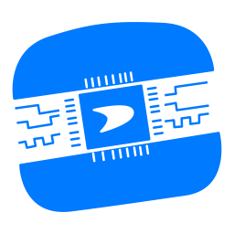

---
# You don't need to edit this file, it's empty on purpose.
# Edit theme's home layout instead if you wanna make some changes
# See: https://jekyllrb.com/docs/themes/#overriding-theme-defaults
# This is the front-matter. Below the hyphens are the content.
layout: single
author_profile: false

header:
  overlay_color: "#000"
  overlay_filter: "0.45"
  overlay_image: assets/images/background.jpg
  actions:
    - label: "About"
      url: "/about/"
  caption: "[**SUndwich**](https://web.archive.org/web/20220301205859/http://acoustics.sabanciuniv.edu/~abozkurt/)"
  excerpt: " SUndwich is an open-source FPGA daughterboard designed for use in introductory digital design courses."
---
